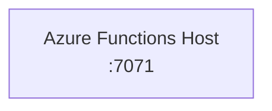

# Plan Template

Create `.azure/local-development-plan.md` using this template. This file is **mandatory** and serves as the source of truth for the entire local development setup workflow.

## ⛔ BLOCKING REQUIREMENT

You **MUST** create this plan file BEFORE generating any configuration files. Present the plan to the user and get approval before proceeding to execution.

---

## Template

````markdown
# Local Development Plan

> Generated by the `azure-local-debug` skill. This plan describes the local
> development setup requirements for the current workspace.
>
> **Status:** Planning | Approved | Executing | Implemented  
> **Orchestrator:** {docker-compose | Aspire AppHost} *(set by classification — see [orchestrators/](orchestrators/))*  
> **Created:** {ISO-8601 datetime, e.g. 2026-03-27T20:08:48Z}  
> **Last Updated:** {ISO-8601 datetime, updated on every status change}

---

## Table of Contents

| Step | Summary |
|------|---------|
| [Prerequisites](#prerequisites) | Tools that must be installed on the host before running locally. |
| [Limited Support](#limited-support) | *(if applicable)* Features detected that are not yet fully supported. |
| [Architecture Diagram](#architecture-diagram) | Mermaid diagram showing high level app-to-emulator connections. |
| [Emulators](#emulators) | Azure service dependencies running as Docker containers via docker-compose. |
| [Migrations](#migrations) | *(if applicable)* Database schema applied automatically on `docker compose up`. |
| [Convenience Scripts](#convenience-scripts) | Convenience scripts for starting / stopping / cleaning emulators and running migrations. |
| [Launch Configuration](#launch-configuration) | IDE debug/launch and task/build configuration for one-click debugging. |
| [API Test Collections](#api-test-collections) | Scripts & sample data to invoke each endpoint or trigger for local verification. |

---

## Prerequisites

<!-- List all required tools with detected versions. Mark installed vs. missing. -->
<!-- The user is responsible for installing any missing prerequisites before approving the plan. -->
<!-- Do NOT install tools on behalf of the user during execution. -->

| Tool | Required | Installed | Version | Install |
|------|----------|-----------|---------|---------|
| Node.js & npm | ✅ | {✅/❌} | {version} | nodejs.org |
| Azure Functions Core Tools | ✅ | {✅/❌} | {version} | aka.ms/azure-functions-core-tools |
| Docker | ✅ | {✅/❌} | {version} | docker.com/get-started |

> ⚠️ **Action required:** Please install any tools marked ❌ before approving this plan. The execution phase will not install prerequisites for you.

---

## Limited Support

<!-- MANDATORY when any limited-support features were detected during classification. -->
<!-- If ANY project type, runtime, IDE, or emulator was flagged as limited support, this section MUST be included. -->
<!-- If no limited-support features were found, omit this entire section. -->
<!-- Use the exact canonical warning format defined in limited-support.md. -->
<!-- Category may be any of: Project type, Runtime, IDE, or Emulator. -->

| Category | Value | Impact |
|----------|-------|--------|
| {Category} | {value} | {impact} |

> ⚠️ The features listed above are not yet fully supported by this skill. The skill will proceed with a best-effort approach. Review these limitations before approving the plan.

---

## Architecture Diagram

{One sentence describing how the app connects to its local dependencies.}

<!-- Mermaid service-to-service diagram generated from scan results. -->
<!-- Shows the application process, each emulator, and the bindings/SDKs that connect them. -->
<!-- See generate.md § Architecture Diagram for guidelines. -->



---

## Emulators

<!-- For each Azure service dependency, define the emulator configuration. -->
<!-- Each emulator section should include: connection string, port, and a docker-compose snippet. -->
<!-- Number the emulators sequentially. -->

### 1. {Emulator Name} ({Azure Service})

- **Connection:** `{connection-string}`
- **Port:** `{host-port}`

<details>
<summary>docker-compose</summary>

```yaml
services:
  {service-name}:
    image: {docker-image}
    ports:
      - "{host-port}:{container-port}"
    volumes:
      - ./.{service-name}:/data
    restart: unless-stopped
```

</details>

<!-- Repeat for each emulator, incrementing the number -->

---

## Migrations

<!-- Only include this section when database migrations are detected during the scan phase. -->
<!-- If no migrations are found, omit this section entirely. -->
<!-- See migrations.md for detection rules and docker-compose patterns. -->

Migrations are applied automatically via the `db-migrate` service on `docker compose up`.

### Detection

| Attribute | Value |
|-----------|-------|
| Migration Tool | {Raw SQL / Prisma / Knex / Drizzle / TypeORM} |
| Migration Directory | {path, e.g., `migrations/`} |
| File Count | {n} file(s) |
| Target Database | {database type} (`{compose service name}` service) |

### Auto-Migration

<!-- Include the docker-compose snippet for the migration service here, adapted from migrations.md for the detected database type. -->

<details>
<summary>docker-compose</summary>

```yaml
services:
  {database-service}:
    # ... existing emulator config ...
    healthcheck:
      test: {healthcheck-command}
      interval: 5s
      timeout: 5s
      retries: 5
      start_period: 30s

  db-migrate:
    image: {runner-image}
    depends_on:
      {database-service}:
        condition: service_healthy
    volumes:
      - ./{migration-directory}:/migrations:ro
    entrypoint: {migration-command}
    restart: "no"
```

</details>

---

## Convenience Scripts

<!-- Use the project's native script runner. See runtimes/{rt}.md for the ecosystem-specific template. -->

```sh
# Emulators
npm run emulators:start   # start (preserves data)
npm run emulators:stop    # stop
npm run emulators:clean   # stop and wipe data

# Database
npm run db:migrate        # apply migrations (emulators must be running)
```

<details>
<summary>package.json</summary>

<!-- For Node.js / TypeScript projects: -->

```json
// package.json
{
  "scripts": {
    "emulators:start": "docker compose down && docker compose up -d",
    "emulators:stop":  "docker compose down",
    "emulators:clean": "docker compose down && rm -rf {data-dirs}",
    "db:migrate":      "{migration-command}"
  }
}
```

<!-- Replace {data-dirs} with the space-separated list of ./.{name} emulator data directories from docker-compose.yml -->

</details>

---

## Launch Configuration

<!-- Define the IDE debug/launch and task configurations for one-click debugging. -->
<!-- The shape of these configs is IDE-specific — see ide/{ide}.md for format. -->
<!-- The generic debugger properties (port, startup command) come from project-types/ and runtimes/ references. -->

### Debug/Launch Configuration

<details>
<summary>Debug/launch configuration</summary>

<!-- IDE-specific debug/launch configuration block here -->
<!-- See references/ide/{ide}.md for format -->

</details>

### Task/Build Configuration

<details>
<summary>Task/build configuration</summary>

<!-- IDE-specific task/build configuration block with dependency chain here -->
<!-- See references/ide/{ide}.md for format -->

</details>

<br>

> If the IDE debug configuration already matches this shape, or if the shape already accomplishes the end goals, then no additional changes are needed.

---

## API Test Collections

<!-- List test scripts for each endpoint/trigger in the project. -->
<!-- Each test gets a subdirectory under api-test-collections/local-development/ with an invoke.sh and optional sample data. -->

API test collections for local development are stored under `api-test-collections/local-development/` in the workspace. Each subdirectory represents one test and contains a script to invoke it plus any sample data files needed.

```
api-test-collections/
  local-development/
    {test-name}/
      invoke.sh
      {optional-sample-data-files}
```

> 💡 Once the app is running via your IDE's debug action, you can ask the agent to execute these test scripts to verify your endpoints and triggers against `localhost`.

### {METHOD} {route}

<details>
<summary>invoke.sh</summary>

```sh
#!/bin/bash
curl -i {url}
```

</details>

<!-- Repeat for each endpoint/trigger -->
<!-- When a test has sample data files, list them in the <summary> alongside invoke.sh, e.g.: -->
<!-- <summary>invoke.sh, sample.json</summary> -->
<!-- And add a note inside the details block describing the sample data file. -->

---

## Debug Configuration Checklist

> **Managed in Phase 3 by the Agent — replace each ❌ with a real terminal run result.**

```
Debug Configuration Checklist:
❌ {config-name} — Not yet validated
```

<!-- After running each config's startup commands in the terminal, replace ❌ with ✅ and the ready signal observed (e.g. "Host lock lease acquired", "ready in 312ms"). One line per config. Do NOT mark ✅ without having actually run the commands. -->

````

---

## Instructions

1. **Create the plan first** — Fill in all sections based on scan results
2. **Update the Table of Contents** — Replace each summary row with one sentence describing the actual detected configuration (e.g., emulator names, database type, port numbers)
3. **Be specific** — Use actual detected versions, ports, connection strings, function names
4. **Include docker-compose snippets** — Each emulator gets a collapsible YAML block; the full `docker-compose.yml` combines them all
5. **Number emulators sequentially** — Use `### 1.`, `### 2.`, etc. for each emulator subsection
6. **Omit Migrations if not applicable** — Only include the Migrations section when database migrations are detected
7. **Present to user** — Show the plan and ask for approval
8. **Track status** — Update the **Status** field at the top as you progress. Only set status to `Implemented` after the Debug Configuration Checklist has been filled in with real validation results.
9. **Fill in the Validation section** — During Phase 3, replace each ❌ stub in the Debug Configuration Checklist with a ✅ or ❌ and the observed result. Do NOT set status to `Implemented` until every stub has been replaced.
10. **Set Created timestamp** — When first writing the plan, set **Created** to the current UTC datetime in ISO 8601 format (e.g. `2026-03-27T20:08:48Z`). This field must never be changed after initial creation.
11. **Update Last Updated timestamp** — Set **Last Updated** to the current UTC datetime in ISO 8601 format every time the Status field changes (Planning → Approved → Executing → Implemented) or any other edit is made to the plan.

The plan is the **single source of truth** for the execution phase.
