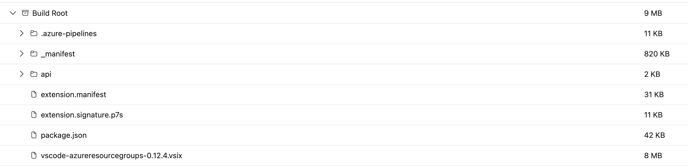
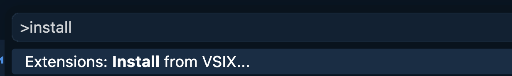
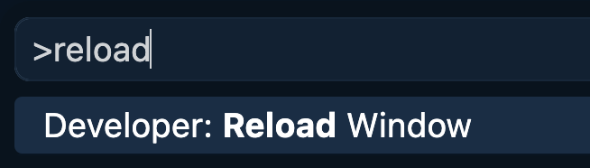

# 🚂 Copilot on Rails

**Copilot on Rails** is delivered through the [Azure Resource Groups extension](https://github.com/microsoft/vscode-azureresourcegroups). It walks you through scaffolding a new Azure project and setting up local debugging using a custom agent and two skills: **azure-project-scaffold** and **azure-local-debug**.

---

## Skills

Both skills are triggered naturally through the Copilot on Rails guided agent flow.

| Skill                    | What it does                                                                    |
| ------------------------ | ------------------------------------------------------------------------------- |
| `azure-project-scaffold` | Plans and scaffolds a new Azure-centric project end-to-end                      |
| `azure-local-debug`      | Sets up local dev environment — emulators, IDE configs, and API test collections |

---

## Prerequisites

| Tool                                                                                       | Required for              |
| ------------------------------------------------------------------------------------------ | ------------------------- |
| [VS Code](https://code.visualstudio.com/)                                                  | IDE                       |
| [GitHub Copilot](https://github.com/features/copilot)                                      | Agent mode                |
| [Azure Resource Groups extension](https://github.com/microsoft/vscode-azureresourcegroups) | Copilot on Rails skills   |
| [Docker Desktop](https://www.docker.com/products/docker-desktop/)                          | Local emulators           |
| [Node.js / npm](https://nodejs.org/)                                                       | Runtime                   |
| [Azure CLI](https://learn.microsoft.com/cli/azure/install-azure-cli)                       | Azure resource management |
| [Azure Functions Core Tools](https://learn.microsoft.com/azure/azure-functions/functions-run-local) | Running Functions locally |
| [Git](https://git-scm.com/)                                                                | Cloning start repos, stashing between runs |

---

## Installing the Resource Groups Extension

1. Open the [pipeline artifacts page](https://dev.azure.com/devdiv/DevDiv/_build/results?buildId=14070682&view=artifacts&pathAsName=false&type=publishedArtifacts).
2. Download `vscode-azureresourcegroups-0.12.4.vsix`.
   
3. Open the command palette (`Ctrl+Shift+P` / `Cmd+Shift+P`).
4. Select **Extensions: Install from VSIX…** and choose the downloaded file.
   
5. Open the command palette again and select **Developer: Reload Window**.
   

---

## Test Paths

There are two ways to test the experience.

### 🟢 Test A — Full Journey (Greenfield)

|              |                                                                                               |
| ------------ | --------------------------------------------------------------------------------------------- |
| **Repo**     | [Copilot-On-Rails-Greenfield-Study](https://github.com/MicroFish91/Copilot-On-Rails-Skills-Study) |
| **Skills**   | `azure-project-scaffold` → `azure-local-debug`                                                |
| **Time**     | Longer — end-to-end                                                                           |

Open this repo in VS Code and run the extension.

### 🟡 Test B — Local Debug Only (Brownfield)

|              |                                      |
| ------------ | ------------------------------------ |
| **Repo**     | [Copilot-On-Rails-Brownfield-Study](https://github.com/MicroFish91/Copilot-on-Rails-Brownfield-Study) |
| **Skills**   | `azure-local-debug` only             |
| **Time**     | Shorter — focused on local dev setup |

Open the brownfield project repo in VS Code and run the extension. Useful for saving time or focusing on the debugging experience.
